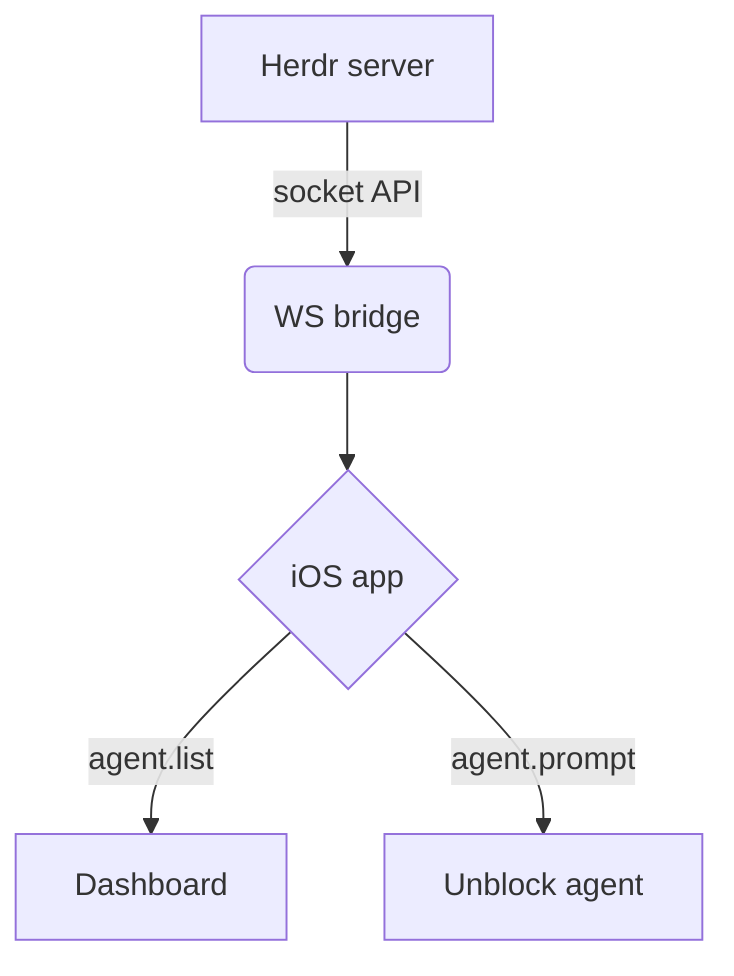

# Mermaid render test

Open this in nvim inside kitty or wezterm. The block below should render as an image.

```mermaid
graph TD
    A[Herdr server] -->|socket API| B(WS bridge)
    B --> C{iOS app}
    C -->|agent.list| D[Dashboard]
    C -->|agent.prompt| E[Unblock agent]
```

Some text after the diagram.
